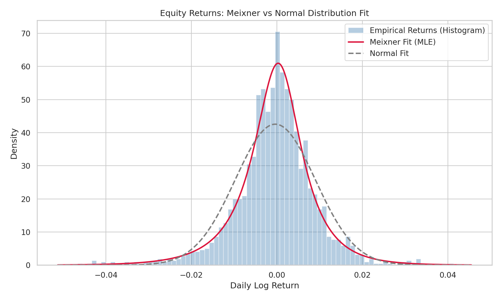
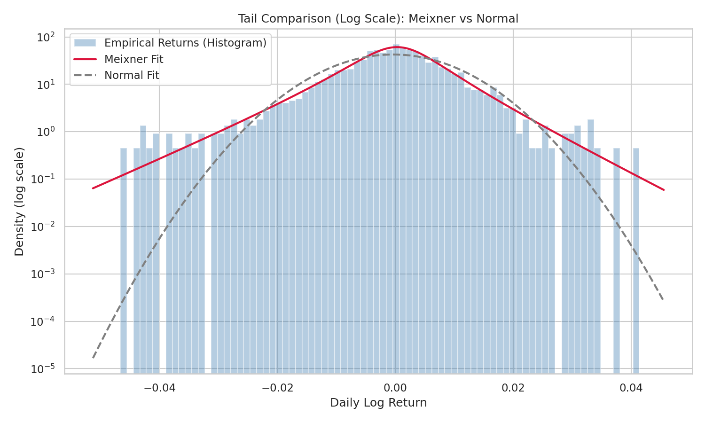
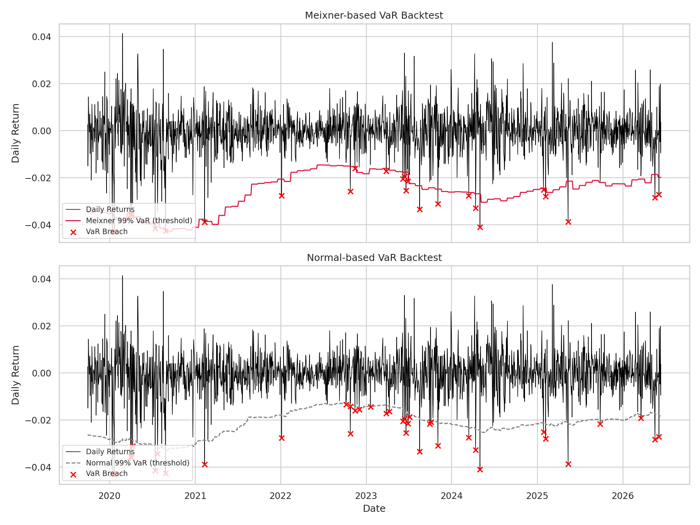

# Meixner Distribution Implementation for Equity Risk Modeling

A quantitative risk modeling project that implements the **Meixner
distribution** from scratch for capturing heavy-tailed behavior in daily
equity returns, fits it via **Maximum Likelihood Estimation (MLE)**, and
validates its risk-forecasting performance against a standard Gaussian
model using **Value-at-Risk (VaR)** backtests and the **Kupiec Proportion
of Failures (POF)** test.

This project was built to demonstrate practical model-validation
techniques used in market risk and equity derivatives validation -
distribution fitting, goodness-of-fit diagnostics, VaR estimation, and
regulatory-style backtesting (Basel Traffic Light approach).

---

## Why the Meixner Distribution?

Daily equity returns are well known to exhibit:

- **Heavy tails (excess kurtosis)** - extreme moves happen more often than
  a Normal distribution predicts.
- **Negative skewness** - large drawdowns are more common/severe than
  large rallies.

The Normal distribution systematically **underestimates tail risk**,
leading to VaR models that under-predict losses and breach their
confidence level too often. The Meixner distribution is a four-parameter
member of the generalized hyperbolic family that can flexibly match both
the skewness and kurtosis of empirical return data, making it a better fit
for parametric VaR.

| Parameter | Role |
|-----------|------|
| `alpha`   | Scale |
| `beta`    | Skewness / asymmetry |
| `delta`   | Shape (tail thickness) |
| `m`       | Location |

---

## Project Structure

```
meixner-project/
├── src/
│   ├── meixner_distribution.py   # PDF, log-PDF, MLE fitting, theoretical moments
│   ├── var_calculation.py        # Meixner & Normal VaR, rolling-window backtest pipeline
│   ├── kupiec_backtest.py        # Kupiec POF test + Basel Traffic Light classification
│   └── generate_data.py          # Synthetic equity return generator (sample data)
├── data/
│   └── synthetic_equity_returns.csv
├── tests/
│   └── test_meixner.py           # Unit tests (pytest)
├── results/
│   ├── meixner_vs_normal_pdf.png
│   ├── meixner_vs_normal_tails_log.png
│   ├── var_backtest_comparison.png
│   └── summary_results.txt
├── main.py                       # End-to-end pipeline: fit, plot, backtest
├── requirements.txt
└── README.md
```

---

## Methodology

### 1. Distribution Fitting

The Meixner PDF is implemented directly from its analytic form using the
complex gamma function:

```
f(x; α, β, δ, m) = (2cos(β/2))^(2δ) / (2απ Γ(2δ)) · exp(β(x-m)/α) · |Γ(δ + i(x-m)/α)|²
```

Parameters are estimated via **Maximum Likelihood Estimation**, with
starting values derived from the analytic moment relationships (mean,
variance, skewness, excess kurtosis) and refined using L-BFGS-B
optimization of the negative log-likelihood.

### 2. Value-at-Risk (VaR)

VaR is computed as the negative of the lower-tail quantile of the fitted
distribution. A **rolling 250-day window** is used, with the Meixner
distribution re-fit every 20 trading days, to produce a time series of VaR
estimates comparable to a production risk system. A Normal-distribution
VaR is computed the same way as a benchmark.

### 3. Backtesting - Kupiec POF Test

The Kupiec (1995) Proportion of Failures test compares the **observed
breach rate** (returns exceeding the VaR threshold) against the
**expected breach rate** implied by the confidence level, using a
likelihood-ratio statistic that is chi-squared(1) distributed under the
null hypothesis that the model is correctly calibrated.

The project also implements the **Basel Traffic Light** classification
(Green / Yellow / Red zones) based on the number of exceptions in a
250-day window.

---

## Results (Synthetic Data, 99% VaR, 250-day window)

| Model   | Exceptions / Observations | Observed Breach Rate | Kupiec p-value | Verdict |
|---------|---------------------------|----------------------|----------------|---------|
| Meixner | 25 / 1750                  | 1.43%                | 0.090          | **Accept** — consistent with 99% confidence |
| Normal  | 37 / 1750                  | 2.11%                | <0.0001        | **Reject** — breach rate too high |

The Meixner-based VaR produces a breach rate statistically consistent with
the stated 99% confidence level, while the Normal-based VaR significantly
under-predicts tail risk and is rejected by the Kupiec test.

### Distribution Fit



### Tail Comparison (Log Scale)



### VaR Backtest



---

## Getting Started

### Installation

```bash
git clone https://github.com/<Viku-51>/meixner-equity-risk-model.git
cd meixner-equity-risk-model
pip install -r requirements.txt
```

### Generate sample data

```bash
cd src
python generate_data.py
```

### Run the full pipeline

```bash
python main.py
```

This will fit the Meixner distribution, generate comparison plots in
`results/`, run rolling VaR + Kupiec backtests, and write
`results/summary_results.txt`.

### Run tests

```bash
pytest tests/ -v
```

---

## Using Real Market Data

`src/generate_data.py` produces synthetic returns for demonstration. To
use real historical price data, replace the data-loading step in
`main.py` with your own returns series (e.g., loaded from a CSV of
adjusted close prices):

```python
import numpy as np
import pandas as pd

prices = pd.read_csv("my_prices.csv", index_col=0, parse_dates=True)["close"]
returns = np.diff(np.log(prices.values))
```

---

## Key Techniques Demonstrated

- Implementation of a non-trivial probability distribution (Meixner) from
  its analytic definition, including complex-valued special functions.
- Maximum Likelihood Estimation with moment-based starting values and
  bounded numerical optimization.
- Parametric VaR estimation and rolling-window backtesting.
- Kupiec POF likelihood-ratio testing and Basel Traffic Light
  classification — standard regulatory model-validation tools.
- Unit testing of statistical code (PDF normalization, moment
  relationships, MLE convergence, backtest logic).

---

## License

MIT License — see [LICENSE](LICENSE).

## Author

**Vikrant Chandra**
[LinkedIn](https://www.linkedin.com/in/vikrant-chandra/) ·
[vikrantchandra12@gmail.com](mailto:vikrantchandra12@gmail.com)
